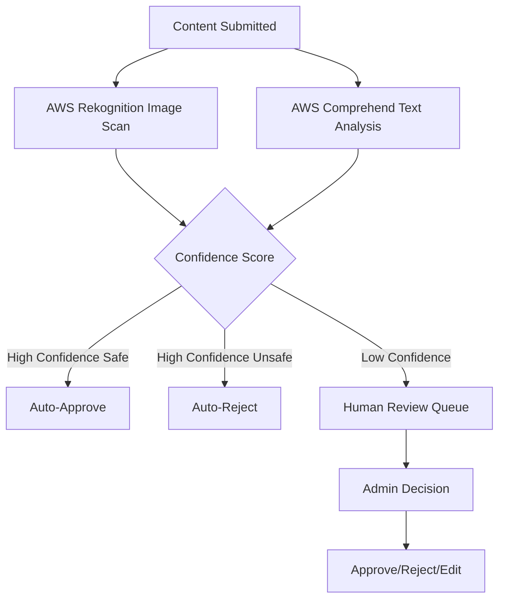

# Design Document

## Overview

This design document outlines the architecture and implementation approach for a comprehensive directory template that combines TanStack Start with AWS Amplify Gen 2. The system is designed to be a production-ready, scalable foundation for business directories with robust authentication, content management, SEO optimization, and monetization capabilities.

The architecture leverages modern serverless technologies to provide automatic scaling, cost efficiency, and excellent developer experience while maintaining high performance and security standards.

## Architecture

### High-Level Architecture

The system follows a modern full-stack serverless architecture with clear separation of concerns:

```
┌─────────────────┐    ┌──────────────────┐    ┌─────────────────┐
│   Frontend      │    │    Backend       │    │   External      │
│  TanStack Start │◄──►│  AWS Amplify     │◄──►│   Services      │
│                 │    │     Gen 2        │    │                 │
└─────────────────┘    └──────────────────┘    └─────────────────┘
│                      │                      │
├─ React 19           ├─ AWS AppSync        ├─ Stripe
├─ TanStack Router    ├─ AWS Cognito        ├─ AWS Rekognition
├─ TanStack Query     ├─ AWS DynamoDB       ├─ AWS Comprehend
├─ Tailwind CSS       ├─ AWS S3             ├─ AWS WAF
└─ Amplify UI         ├─ AWS Lambda         └─ Map Services
                      └─ AWS CloudFront
```

### Technology Stack Rationale

**Frontend (TanStack Start):**
- **Streaming SSR**: Enables progressive content delivery for optimal Core Web Vitals
- **Isomorphic Loaders**: Unified data fetching for server and client, reducing code duplication
- **Type Safety**: End-to-end TypeScript for reduced runtime errors
- **File-based Routing**: Intuitive URL structure that mirrors directory organization

**Backend (AWS Amplify Gen 2):**
- **Code-first Approach**: TypeScript-based schema definition with compile-time validation
- **Serverless Auto-scaling**: Automatic resource provisioning based on demand
- **Integrated Security**: Built-in authentication, authorization, and network protection
- **Global CDN**: CloudFront integration for worldwide content delivery

## Components and Interfaces

### Data Models

#### Core Listing Model
```typescript
type Listing = {
  id: string
  name: string
  description: string
  address: {
    street: string
    city: string
    state: string
    zipCode: string
    country: string
    coordinates: {
      latitude: number
      longitude: number
    }
  }
  contactInfo: {
    phone?: string
    email?: string
    website?: string
  }
  socialMedia: {
    facebook?: string
    twitter?: string
    instagram?: string
    linkedin?: string
  }
  images: string[] // S3 URLs
  hoursOfOperation: {
    [day: string]: {
      open: string
      close: string
      closed: boolean
    }
  }
  pricingRange: 'BUDGET' | 'MODERATE' | 'EXPENSIVE' | 'LUXURY'
  categories: string[]
  tags: string[]
  features: string[]
  amenities: string[]
  slug: string
  status: 'PENDING' | 'PUBLISHED' | 'DRAFT' | 'ARCHIVED'
  ownerId?: string
  isSponsored: boolean
  sponsoredRank?: number
  sponsoredTier?: 'BRONZE' | 'SILVER' | 'GOLD'
  createdAt: string
  updatedAt: string
  version: number
}
```

#### User and Authentication Models
```typescript
type User = {
  id: string
  email: string
  firstName: string
  lastName: string
  avatar?: string
  role: 'USER' | 'BUSINESS_OWNER' | 'ADMIN'
  profile: {
    bio?: string
    location?: string
    preferences: {
      emailNotifications: boolean
      marketingEmails: boolean
    }
  }
  createdAt: string
  updatedAt: string
}

type Review = {
  id: string
  listingId: string
  userId: string
  rating: number // 1-5
  comment?: string
  status: 'PENDING' | 'APPROVED' | 'REJECTED'
  response?: {
    text: string
    respondedAt: string
    respondedBy: string
  }
  createdAt: string
  updatedAt: string
}
```

#### Monetization Models
```typescript
type Ad = {
  id: string
  imageUrl: string
  targetUrl: string
  dimensions: string // e.g., "728x90", "300x250"
  placement: string // e.g., "homepage-top", "sidebar"
  startDate: string
  endDate: string
  isActive: boolean
  impressions: number
  clicks: number
  ownerId: string
}

type Subscription = {
  id: string
  userId: string
  tier: 'BRONZE' | 'SILVER' | 'GOLD'
  stripeSubscriptionId: string
  status: 'ACTIVE' | 'CANCELED' | 'PAST_DUE'
  currentPeriodStart: string
  currentPeriodEnd: string
  features: string[]
}
```

### API Design

#### GraphQL Schema Structure
The system uses AWS AppSync with a comprehensive GraphQL schema that supports:

**Queries:**
- `listListings(filter, sort, limit, nextToken)` - Paginated listing retrieval with filtering
- `getListing(id)` - Individual listing details with related data
- `searchListings(query, filters, location)` - Full-text search with geospatial filtering
- `getUser(id)` - User profile information
- `listReviews(listingId, limit, nextToken)` - Paginated reviews for a listing

**Mutations:**
- `createListing(input)` - Submit new listing (authenticated or guest)
- `updateListing(id, input)` - Update existing listing (owner only)
- `claimListing(id, verificationData)` - Associate listing with authenticated user
- `createReview(input)` - Submit review with moderation
- `respondToReview(reviewId, response)` - Business owner response

**Subscriptions:**
- `onListingStatusChanged(id)` - Real-time status updates for moderation
- `onReviewAdded(listingId)` - New review notifications

#### Authorization Rules
```typescript
// Example authorization patterns
const listingAuth = {
  create: [allow.guest(), allow.authenticated()],
  read: [allow.public()],
  update: [allow.owner(), allow.groups(['admin'])],
  delete: [allow.groups(['admin'])]
}

const reviewAuth = {
  create: [allow.authenticated()],
  read: [allow.public()],
  update: [allow.owner(), allow.groups(['admin'])],
  delete: [allow.groups(['admin'])]
}
```

### Frontend Component Architecture

#### Route Structure
```
src/routes/
├── __root.tsx                 # Root layout with navigation
├── index.tsx                  # Homepage with featured listings
├── listings/
│   ├── index.tsx             # Listing search/browse
│   ├── $listingId.tsx        # Individual listing details
│   ├── submit.tsx            # Listing submission form
│   └── claim.$listingId.tsx  # Listing claim process
├── categories/
│   ├── index.tsx             # Category overview
│   └── $categorySlug.tsx     # Category-specific listings
├── search.tsx                # Search results page
├── _authed/                  # Protected routes
│   ├── profile.tsx           # User profile management
│   ├── dashboard.tsx         # User dashboard
│   └── admin/                # Admin-only routes
│       ├── listings.tsx      # Listing moderation
│       ├── users.tsx         # User management
│       └── analytics.tsx     # Platform analytics
└── auth/
    ├── login.tsx
    ├── signup.tsx
    └── reset-password.tsx
```

#### Key Components
- **ListingCard**: Reusable listing display component with sponsorship indicators
- **SearchInterface**: Advanced search with filters and auto-completion
- **MapView**: Interactive map with clustering and popups (client-side only)
- **ReviewSystem**: Review display and submission with optimistic updates
- **ModerationQueue**: Admin interface for content approval
- **PaymentFlow**: Stripe integration for subscriptions and sponsorships

## Data Models

### Database Design (DynamoDB)

#### Single Table Design Pattern
The system uses DynamoDB's single-table design for optimal performance and cost efficiency:

```
PK (Partition Key)    | SK (Sort Key)           | Entity Type | Attributes
---------------------|-------------------------|-------------|------------
LISTING#123          | METADATA                | Listing     | name, description, address...
LISTING#123          | REVIEW#456              | Review      | rating, comment, userId...
LISTING#123          | IMAGE#789               | Image       | s3Url, alt, order...
USER#abc             | METADATA                | User        | email, name, role...
USER#abc             | FAVORITE#123            | Favorite    | listingId, createdAt...
CATEGORY#food        | LISTING#123             | CategoryMap | listingId, featured...
LOCATION#city#state  | LISTING#123             | LocationMap | listingId, coordinates...
```

#### Global Secondary Indexes (GSIs)
1. **GSI1**: Status-based queries (PK: status, SK: createdAt)
2. **GSI2**: Location-based queries (PK: location, SK: distance)
3. **GSI3**: Category-based queries (PK: category, SK: sponsoredRank)
4. **GSI4**: User-based queries (PK: userId, SK: entityType)

### Content Moderation Pipeline

#### Automated Screening Process


#### Spam Detection Strategy
- **Honeypot Fields**: Hidden form fields to catch bots
- **Rate Limiting**: AWS WAF rules to prevent rapid submissions
- **ML-based Detection**: Custom models for spam pattern recognition
- **User Behavior Analysis**: Tracking submission patterns and flagging anomalies

## Error Handling

### Client-Side Error Handling

#### TanStack Query Error Boundaries
```typescript
// Global error handling with TanStack Query
const queryClient = new QueryClient({
  defaultOptions: {
    queries: {
      retry: (failureCount, error) => {
        if (error.status === 404) return false
        return failureCount < 3
      },
      staleTime: 5 * 60 * 1000, // 5 minutes
    },
    mutations: {
      onError: (error) => {
        toast.error(`Operation failed: ${error.message}`)
      }
    }
  }
})
```

#### Route-Level Error Handling
```typescript
// Route error boundaries with TanStack Router
export const Route = createFileRoute('/listings/$listingId')({
  loader: async ({ params }) => {
    try {
      return await fetchListing(params.listingId)
    } catch (error) {
      throw new NotFoundError('Listing not found')
    }
  },
  errorComponent: ({ error }) => (
    <ErrorBoundary error={error} />
  )
})
```

### Server-Side Error Handling

#### Lambda Function Error Patterns
```typescript
// Standardized error handling in Amplify Functions
export const handler = async (event) => {
  try {
    const result = await processRequest(event)
    return {
      statusCode: 200,
      body: JSON.stringify(result)
    }
  } catch (error) {
    logger.error('Function error', { error, event })
    
    if (error instanceof ValidationError) {
      return {
        statusCode: 400,
        body: JSON.stringify({ error: error.message })
      }
    }
    
    return {
      statusCode: 500,
      body: JSON.stringify({ error: 'Internal server error' })
    }
  }
}
```

#### GraphQL Error Handling
- **Field-level errors**: Graceful degradation when individual fields fail
- **Partial data responses**: Return available data even when some resolvers fail
- **Error categorization**: Distinguish between user errors, system errors, and validation errors

### Monitoring and Alerting

#### CloudWatch Integration
- **Custom Metrics**: Track business KPIs like listing submissions, user registrations
- **Error Tracking**: Automated alerts for error rate thresholds
- **Performance Monitoring**: Lambda duration, DynamoDB throttling, API Gateway latency

## Testing Strategy

### Frontend Testing

#### Unit Testing with Vitest
```typescript
// Component testing example
import { render, screen } from '@testing-library/react'
import { ListingCard } from './ListingCard'

describe('ListingCard', () => {
  it('displays sponsored badge for sponsored listings', () => {
    const sponsoredListing = { ...mockListing, isSponsored: true }
    render(<ListingCard listing={sponsoredListing} />)
    expect(screen.getByText('Sponsored')).toBeInTheDocument()
  })
})
```

#### Integration Testing with Playwright
```typescript
// E2E testing for critical user flows
test('user can submit and claim a listing', async ({ page }) => {
  await page.goto('/listings/submit')
  await page.fill('[name="name"]', 'Test Business')
  await page.fill('[name="description"]', 'Test Description')
  await page.click('button[type="submit"]')
  
  await expect(page.locator('.success-message')).toBeVisible()
})
```

### Backend Testing

#### GraphQL Schema Testing
```typescript
// Schema validation and resolver testing
describe('Listing Resolvers', () => {
  it('creates listing with pending status for unauthenticated users', async () => {
    const result = await testClient.mutate({
      mutation: CREATE_LISTING,
      variables: { input: mockListingInput }
    })
    
    expect(result.data.createListing.status).toBe('PENDING')
  })
})
```

#### Lambda Function Testing
```typescript
// Unit testing for business logic
describe('Content Moderation', () => {
  it('flags inappropriate content for review', async () => {
    const result = await moderateContent({
      text: 'inappropriate content',
      images: ['test-image-url']
    })
    
    expect(result.requiresReview).toBe(true)
    expect(result.confidence).toBeLessThan(0.8)
  })
})
```

### Performance Testing

#### Load Testing Strategy
- **Gradual Load Increase**: Test system behavior under increasing traffic
- **Spike Testing**: Validate auto-scaling capabilities during traffic spikes
- **Endurance Testing**: Long-running tests to identify memory leaks or degradation

#### Core Web Vitals Monitoring
- **Lighthouse CI**: Automated performance testing in CI/CD pipeline
- **Real User Monitoring**: Track actual user experience metrics
- **Synthetic Monitoring**: Continuous performance monitoring from multiple locations

### Security Testing

#### Authentication Testing
- **JWT Token Validation**: Ensure proper token handling and expiration
- **Authorization Rules**: Verify access controls for different user roles
- **Session Management**: Test session timeout and refresh mechanisms

#### Input Validation Testing
- **SQL Injection Prevention**: Validate GraphQL query sanitization
- **XSS Protection**: Test content sanitization and CSP headers
- **File Upload Security**: Validate image upload restrictions and scanning

## SEO and Performance Optimizations

### Server-Side Rendering Strategy

#### Dynamic Metadata Generation
```typescript
// Per-page metadata generation
export const Route = createFileRoute('/listings/$listingId')({
  loader: async ({ params }) => {
    const listing = await fetchListing(params.listingId)
    return { listing }
  },
  meta: ({ loaderData }) => [
    { title: `${loaderData.listing.name} - Business Directory` },
    { name: 'description', content: loaderData.listing.description },
    { property: 'og:title', content: loaderData.listing.name },
    { property: 'og:image', content: loaderData.listing.images[0] }
  ]
})
```

#### Structured Data Implementation
```typescript
// Schema.org JSON-LD generation
const generateListingSchema = (listing: Listing) => ({
  '@context': 'https://schema.org',
  '@type': 'LocalBusiness',
  name: listing.name,
  description: listing.description,
  address: {
    '@type': 'PostalAddress',
    streetAddress: listing.address.street,
    addressLocality: listing.address.city,
    addressRegion: listing.address.state,
    postalCode: listing.address.zipCode
  },
  aggregateRating: {
    '@type': 'AggregateRating',
    ratingValue: listing.averageRating,
    reviewCount: listing.reviewCount
  }
})
```

### Image Optimization Pipeline

#### Multi-Format Delivery
```typescript
// Responsive image component with modern formats
const OptimizedImage = ({ src, alt, sizes }) => (
  <picture>
    <source srcSet={generateSrcSet(src, 'avif')} type="image/avif" />
    <source srcSet={generateSrcSet(src, 'webp')} type="image/webp" />
    
  </picture>
)
```

#### CloudFront Optimization
- **Edge Caching**: Aggressive caching for static assets with proper cache headers
- **Image Transformation**: On-the-fly image resizing and format conversion
- **Compression**: Brotli and Gzip compression for text assets

### Core Web Vitals Optimization

#### Largest Contentful Paint (LCP)
- **Critical Resource Prioritization**: Preload hero images and fonts
- **Streaming SSR**: Progressive content delivery for faster perceived loading
- **Image Optimization**: Responsive images with proper sizing

#### Interaction to Next Paint (INP)
- **Optimistic UI**: Immediate feedback for user interactions
- **Code Splitting**: Lazy load non-critical JavaScript
- **Efficient Event Handlers**: Debounced search and throttled scroll handlers

#### Cumulative Layout Shift (CLS)
- **Reserved Space**: Explicit dimensions for images and ads
- **Font Loading**: Proper font-display strategies to prevent layout shifts
- **Dynamic Content**: Skeleton loaders for loading states

This comprehensive design provides a solid foundation for building a scalable, performant, and monetizable directory platform while maintaining excellent developer experience and user satisfaction.